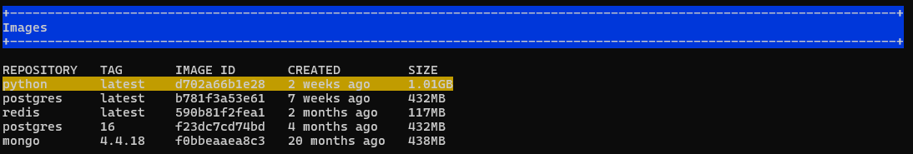

# docker_cmd
A console application for convenient viewing and interaction with Docker objects (images, containers, and volumes).
# How to Run
Download the repository:
```commandline
https://github.com/AlbertSabirzianov/docker_cmd.git
```
If you are using Windows, you need to install windows-curses. There are no dependencies for Linux:
```commandline
pip install windows-curses
```
Go to the src folder:
```commandline
cd docker_cmd/src
```
Run the application:
```commandline
python3 main.py
```
# How to use
Immediately after launching the application, you will see a menu where all the docker images installed on your device are displayed

By pressing the right and left keys, you can easily switch between tabs with docker containers and volumes (there are three tabs in total images, volumes and containers).
Use the forward and backward keys to move the cursor. To select one or more objects, use the space bar or enter keys, after which the selected objects will look like in the picture below.

You can use the following keys to interact with selected objects:
- __d__ (*delete*)
delete all selected objects, if no objects are selected - the object on which the cursor is located is deleted.
- __r__  (*refresh*) all information about docker objects will be updated and all selected objects will become unselected.
- __s__ (*save*) save all selected objects in tar archive, if no objects are selected - the object on which the cursor is located is saved.
- **h** (*help*) show help message with all available commands
- **q, ESC** (*quit*) exit from help message (or from another page)
- **n** (*rename*) rename the object on which the cursor is located. Then you press this key you will see window like on the image bellow
  
  you see a prompt to enter a new name for the selected object, after you enter the desired name and press Enter, the object will be renamed. To exit the new name input mode, press ESC or ctrl+C.
  
  


