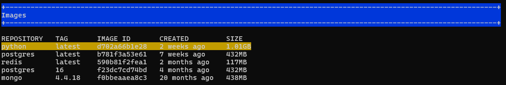
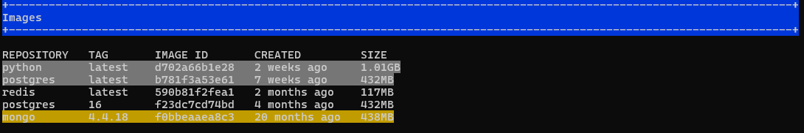
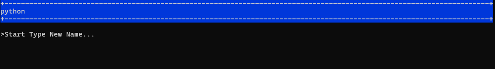
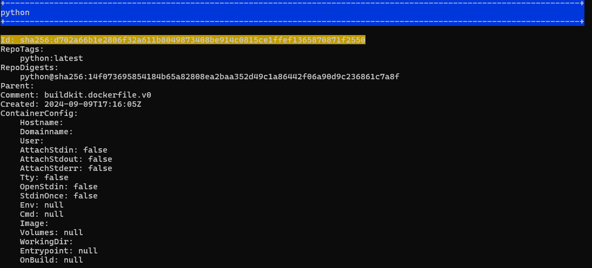
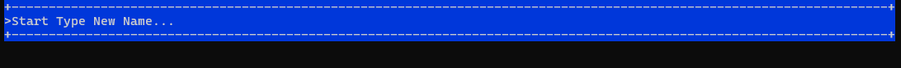
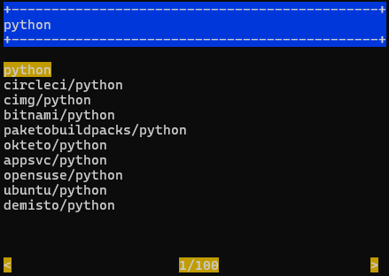
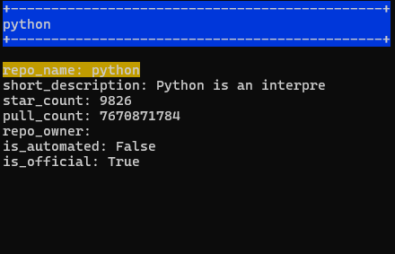
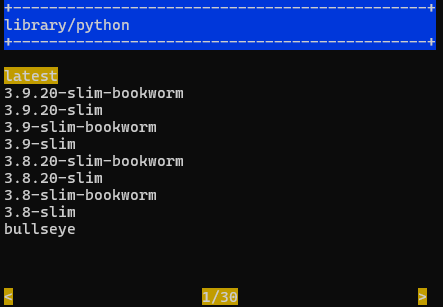
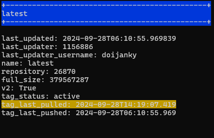

# docker_cmd
Консольное приложение для удобного 
взаимодействия с объектами Docker - образами, контейнерами и томами (`volumes`).
# Как запустить
Скачайте репозиторий:
```commandline
git clone https://github.com/AlbertSabirzianov/docker_cmd.git
```
Если вы используете Windows, нужно установить windows-curses. Для Linux зависимости не требуются:
```commandline
pip install windows-curses
```
Перейдите в папку src:
```commandline
cd docker_cmd/src
```
Запустите приложение:
```commandline
python3 main.py
```
# Как пользоваться
Сразу после запуска приложения вы увидите меню,
в котором отображаются все установленные на вашем устройстве образы Docker.
<br/><br/>
С помощью клавиш «вправо» и «влево» можно легко переключаться между вкладками с контейнерами и томами Docker (всего три вкладки: образы, тома и контейнеры).

Используйте клавиши «вперёд» и «назад»,
чтобы перемещать курсор.
Чтобы выбрать один или несколько объектов,
используйте клавишу «Пробел» или «Enter».
После этого выбранные объекты будут выглядеть так, как показано на изображении ниже.
<br/><br/>
Для взаимодействия с выбранными объектами можно использовать следующие клавиши:

- __d__ (*удалить*) удалить все выбранные объекты. Если объекты не выбраны, удаляется объект, на котором находится курсор.
- __r__  (*обновить*) обновить всю информацию об объектах Docker; все выбранные объекты будут сняты с выделения.
- __s__ (*сохранить*) сохранить все выбранные объекты в tar‑архив. Если объекты не выбраны, сохраняется объект, на котором находится курсор.
- **h** (*справка*) показать сообщение со справкой и всеми доступными командами.
- **q, ESC** (*выход*) выйти из окна справки (или из приложения).
- **n** (*переименовать*) переименовать объект, на котором находится курсор. После нажатия этой клавиши появится окно, как на изображении ниже:
 <br/> <br/>
 Вы увидите приглашение ввести новое имя для выбранного объекта. После того как вы введёте нужное имя и нажмёте «Enter», объект будет переименован. Чтобы выйти из режима ввода нового имени, нажмите **ESC** или **cntl + C**.</b>
- **i** (*подробная информация*) посмотреть детальную информацию об образе или контейнере, на котором находится курсор. Чтобы выйти, нажмите  **ESC** или **q**.
  <br/><br/>
  
- **p** (*поиск*) перейти в режим поиска образов на DockerHub. После перехода в этот режим появится приглашение ввести имя образа.
  <br/><br/>
   
  Когда вы начнёте вводить имя нужного образа, ниже начнут появляться доступные для загрузки образы на DockerHub. С помощью клавиш «вправо» и «влево» можно перейти к следующей/предыдущей странице. Текущую страницу и их общее количество можно увидеть внизу экрана. Чтобы выйти, нажмите **ESC** или **cntl + C**.
  <br/><br/>
  
  Если нажать клавишу **Пробел**  можно увидеть подробную информацию об образе, на котором находится курсор. Чтобы выйти, нажмите **ESC** или **q**
  <br/><br/>
  Чтобы выбрать найденный образ, нажмите **Enter**, после этого вы перейдёте в режим поиска нужного тега. Чтобы выйти, нажмите **ESC** или **cntl + C**
  <br/><br/>

Если нажать клавишу **Пробел** можно увидеть подробную информацию о теге, на котором находится курсор. Чтобы выйти, нажмите **ESC** или **q**.
<br/><br/>
Если вы хотите просто загрузить образ с тегом latest, можно нажать **l** образ с этим тегом будет загружен на ваше устройство. Чтобы выбрать найденный тег, нажмите **Enter**, 
после этого будет загружен образ с выбранным тегом. Чтобы выйти, нажмите **ESC** или **q**.
# Как установить команду `dv` (docker viewer)
Чтобы запускать приложение из любой директории короткой командой `dv`, 
используйте установочные скрипты из папки `src`. __После установки обязательно закройте и откройте консоль заново__
## Windows
1) установите зависимость
    ```commandline
    pip install windows-curses
    ```
2) Запустите установочный скрипт от имени администратора:
    ```commandline
    .\install.bat
    ```
3) Перезапустите консоль. Теперь доступна команда:
    ```commandline
    dv
    ```
## Linux

1) Сделайте установочный файл исполняемым
    ```commandline
    chmod +x install.sh
    ```
2) Запустите установку:
    ```commandline
    ./install.sh
    ```
3) Перезапустите терминал. Теперь доступна команда:
    ```commandline
    dv
    ```


